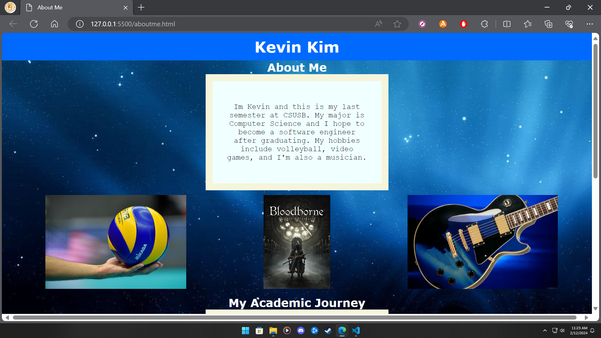

# About Me

This is my sumbmission for assigment 1 for CSE4500 course, where I create an html and css file for a website page, that meets the requirements specified bellow.

Time spent: 3 hours spent in total

## Features

The following **required** features are completed:
- [ ] Modifies title in head so that the tab has a unique name, (e.g. About Me). (1pts)
- [ ] Uses a mix of headers, paragraphs, and div's. (3pts)
- [ ] Includes at least 3 paragraphs. (3pts)
- [ ] Includes at least one image. (2pts)
- [ ] Includes a .css file to style with at least 4 ways to format the elements in the html. (3pts)
- [ ] Includes a link that directs to your Github account (can be main account or specifically to your Platform_Computing Repo). (3pts)

The following **bonus** features are implemented:

- [ ] Applies different font(s). 
- [ ] Applies border and margins. 
- [ ] Created functional button that hyperlinks to Github repo 

## Screenshot and/or Video Walkthrough

## Notes:
PROVIDE RELEVANT OR ADDITIONAL INFORMATION HERE. Below are formatting options to add emphasis in text
<ul>
  <li>**Example in bold**</li>
  <li>*Example in italics*</li>
</ul>
