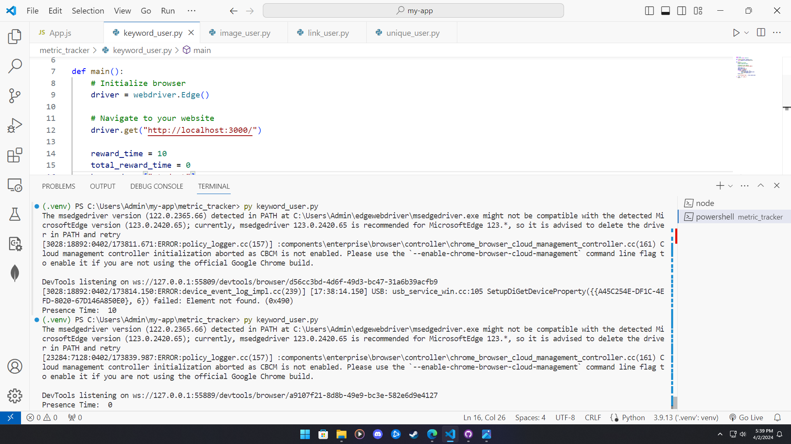
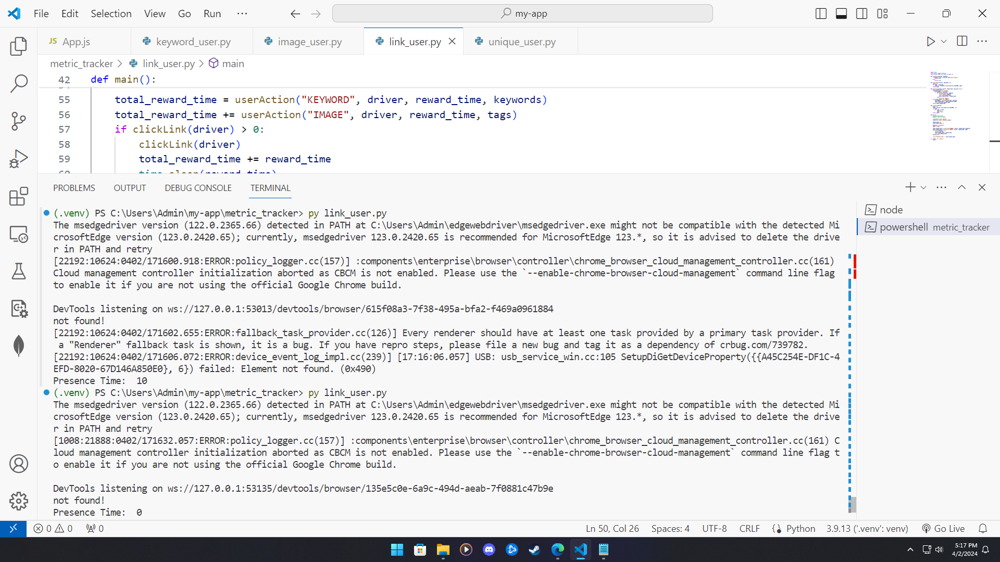
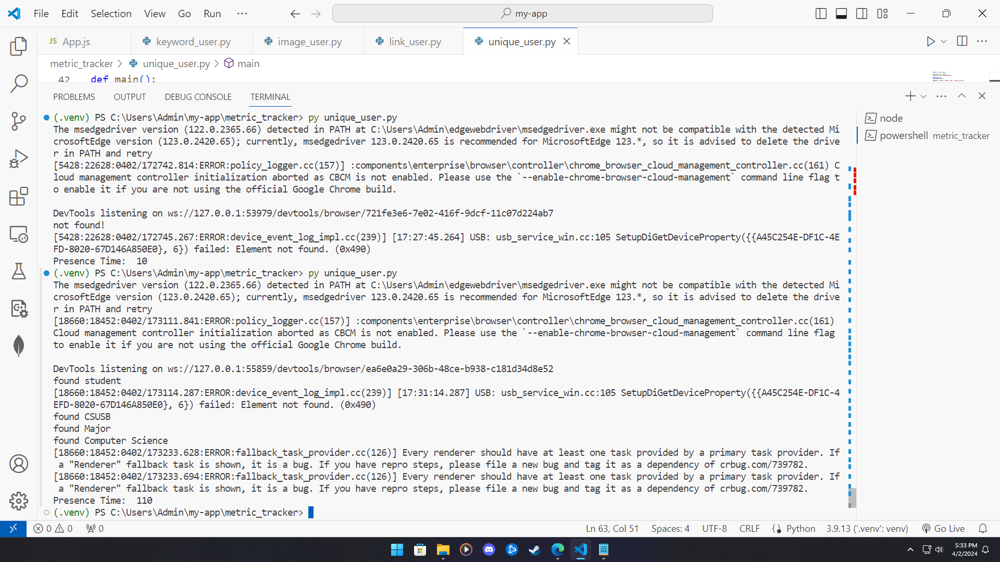

# Generate Users

This is the ReadMe for Assignment 4 Generage Users for CSE4500 Platform Computing course. 
I have created a user with affinity towards keywords, images, and links, as well as a unique user that 
has affinity with all the above mentions affinites along with scrolling. 

Time spent: 4 hours spent in total

## Features

The following **required** features are completed:
- [x] Organize Github folders (2 pts)
- [x] Create a user with affinity towards keyword(s) and verify that it works (3 pts)
- [x] Create a user with affinity towards image(s) and verify that it works (3 pts)
- [x] Create a user with affinity towards links and verify that it works (3 pts)
- [x] Describe a user with unique affinities (1 pt)
- [x] Create a user with unique affinities and verify that it works (3 pts)

The following **bonus** features are implemented:
- [x] Create a unique user with an affinity OUTSIDE of keywords, images, or links (1.5 pt)
- [x] The unique user scrolls to the bottom and top of the webpage, both action increments the presence time.
- [ ] Uploaded files for a unique user BOTH in javascript and python (1.5 pt)
- [ ] DESCRIBE ANY OTHER FEATURES HERE.

## Screenshot and/or Video Walkthrough

## Notes:
PROVIDE RELEVANT OR ADDITIONAL INFORMATION HERE. Below are formatting options to add emphasis in text
<ul>
  <li>**Example in bold**</li>
  <li>*Example in italics*</li>
</ul>
